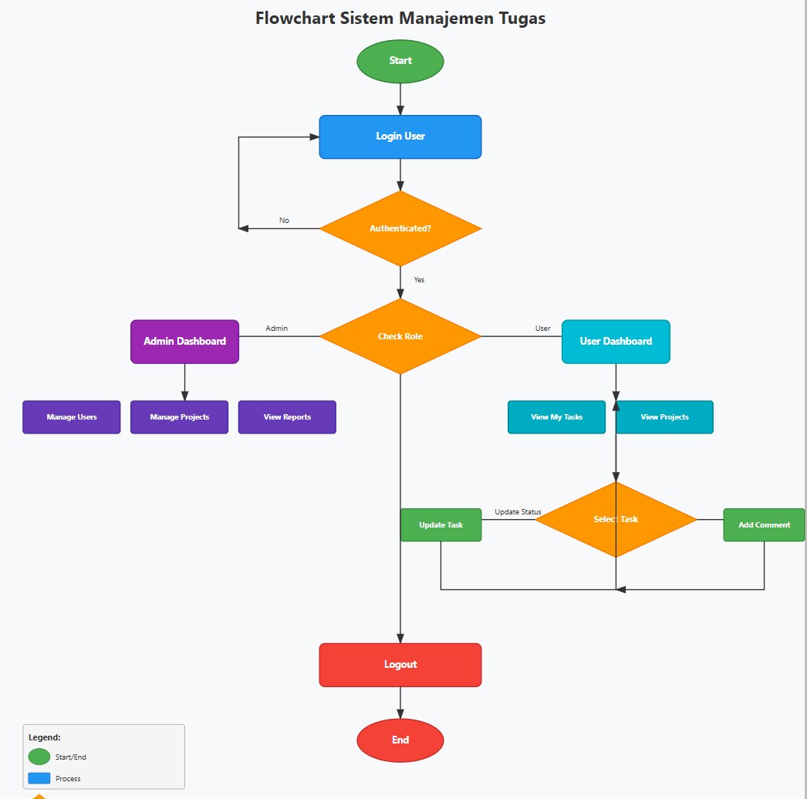

# FDS-Task

Repositori ini berisi project Laravel untuk tugas FDS. Berikut adalah panduan untuk setup project ini di local environment Anda.


## ER Diagram

Di bawah ini adalah ER Diagram.


## Flowchart

Di bawah ini adalah Flowchart.



## Fitur Sistem

Untuk melihat penjelasan lengkap fitur sistem, silakan baca [Dokumentasi Fitur](./dokumen/penjelasan_fitur.md)

## Persyaratan Sistem

Sebelum memulai, pastikan Anda memiliki:
- PHP >= 8.1
- Composer
- MySQL atau MariaDB
- Git

## Cara Instalasi

### 1. Clone Repository

```bash
git clone https://github.com/RendyAFS/FDS-Task.git
cd FDS-Task
```

### 2. Install Dependencies

```bash
composer install
```

### 3. Setup Environment

Salin file `.env.example` menjadi `.env`:

```bash
cp .env.example .env
```

Atau untuk Windows:
```bash
copy .env.example .env
```

### 4. Generate Application Key

```bash
php artisan key:generate
```

### 5. Konfigurasi Database

Buka file `.env` dan sesuaikan konfigurasi database:

```
DB_CONNECTION=mysql
DB_HOST=127.0.0.1
DB_PORT=3306
DB_DATABASE=fdstask
DB_USERNAME=root
DB_PASSWORD=
```

Pastikan Anda sudah membuat database di MySQL/MariaDB dengan nama yang sesuai.

### 6. Jalankan Migrasi Database

```bash
php artisan migrate
```

### 7. Jalankan Database Seeder

Jika project ini memiliki seeder, jalankan perintah berikut:

```bash
php artisan db:seed
```

Atau jika ingin melakukan migrate dan seed sekaligus:

```bash
php artisan migrate:fresh --seed
```

### 8. Install Frontend Dependencies (Opsional)

Jika project menggunakan frontend assets:

```bash
npm install
npm run dev
```

### 9. Jalankan Aplikasi

```bash
php artisan serve
```

Aplikasi akan berjalan di `http://localhost:8000`

## Troubleshooting


### Jika mengalami error cache:

```bash
php artisan optimize:clear
php artisan filament:cache-components
php artisan view:clear
php artisan config:clear
```

## Akun untuk Login

Setelah menjalankan seeder, Anda dapat login menggunakan akun berikut:

| No | Nama                    | Email                         | Role  | Password |
|----|-------------------------|-------------------------------|-------|----------|
| 1  | Admin User              | admin@example.com             | admin | password |
| 2  | Mrs. Marianne Harris I  | hamill.rosalia@example.com    | user  | password |
| 3  | Prof. Oda Lakin         | jacobson.ludwig@example.com   | user  | password |
| 4  | Lenore Lang             | leonard.muller@example.com    | user  | password |
| 5  | Prof. Nova Romaguera IV | evalyn68@example.com          | user  | password |
| 6  | Trace Jenkins           | hodkiewicz.maud@example.com   | user  | password |
| 7  | Bernardo Lehner         | bmarks@example.org            | user  | password |
| 8  | Mara Vandervort Sr.     | macejkovic.vance@example.net  | user  | password |
| 9  | Mr. Will Bernier Sr.    | howard60@example.net          | user  | password |
| 10 | Augusta Block           | bartoletti.kendra@example.com | user  | password |
| 11 | Easter O'Kon            | alvena22@example.com          | user  | password |
| 12 | Dr. Alexandro Jaskolski | carleton.collier@example.net  | user  | password |
| 13 | Madilyn Harris          | mhackett@example.org          | user  | password |
| 14 | Wilfrid Eichmann        | emilie26@example.com          | user  | password |
| 15 | Oral Ullrich I          | kiara.anderson@example.com    | user  | password |
| 16 | Jaiden Kirlin           | corwin.jamil@example.com      | user  | password |

**Catatan:** Semua akun menggunakan password yang sama yaitu `password`.

## Lisensi

[MIT license](https://opensource.org/licenses/MIT)

## Kontributor

- Rendy AFS
